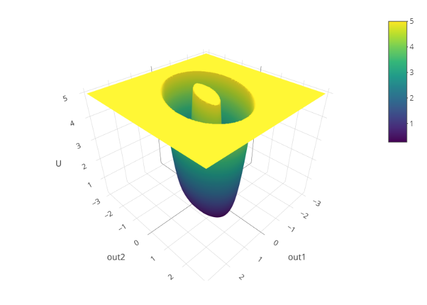
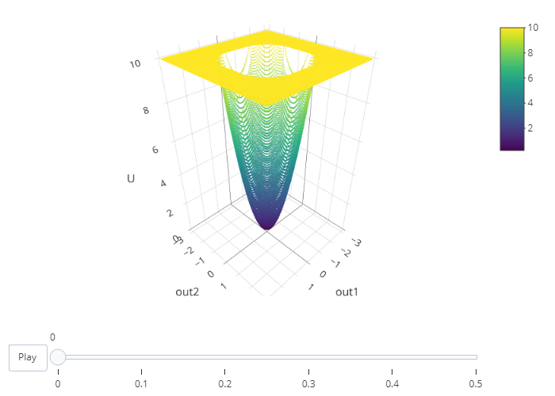

<!-- README.md is generated from README.Rmd. Please edit that file -->

```{r, include = FALSE}
knitr::opts_chunk$set(
  collapse = TRUE,
  comment = "#>",
  fig.path = "man/figures/README-",
  out.width = "100%"
)
```

# simlandr

<!-- badges: start -->
<!-- badges: end -->


The goal of simlandr is to provide a set of tools for constructing potential landscape function for dynamic systems, especially for psychological formal models.

## Installation

You can install the development version from [GitHub](https://github.com/) with:

```{r eval = FALSE}
# install.packages("devtools")
devtools::install_github("Sciurus365/simlandr")
```

## Example

```{r example}
library(simlandr)

# Single simulation

single_test <- sim_fun_test(par1 = list(var1 = 1), 
														par2 = list(var2 = 1, var3 = 0))

# Batch simulation

batch_test <- new_var_set()
batch_test <- batch_test %>%
  # add_var("par1", "var1", 1, 2, 0.3) %>%
  # add_var("par2", "var2", 1, 2, 0.3) %>%
	add_var("par2", "var3", 0, 0.5, 0.1)
batch_test_grid <- make_var_grid(batch_test)

batch_test_result <- batch_simulation(batch_test_grid, sim_fun_test,
  default_list = list(
    par1 = list(var1 = 0),
    par2 = list(var2 = 0, var3 = 0)
  )
)
batch_test_result
batch_test_result <- attach_all_matrices(batch_test_result)

####### WARNING if you are using bigmemory: Due to a bug of RStudio, its variable inspector cannot handle objects with null external pointers. Work around: Turn off "automatically load workspace image"; change the variable inspector to "Manual refresh only", and then load the image and use attach_all_matrices for all batch simulations. After that, you can safely use the variable inspector. #########

# Build landscapes

l1 <- make_2d_density(single_test, x = "out1", from = -2, to = 2, adjust = 0.1)
plot(l1)

l2 <- make_3d_static(single_test, x = "out1", y = "out2", lims = c(-3,3,-3,3), h = 0.5, kde_fun = "MASS")
l2 <- make_3d_static(single_test, x = "out1", y = "out2", lims = c(-3,3,-3,3), h = 0.01, kde_fun = "ks")
# plot(l2)
plotly::orca(plot(l2), file = "man/figures/README-example-l2.png")


l3 <- make_3d_animation_multisim(batch_test_result, x = "out1", y = "out2", fr = "var3", zmax = 10, lims = c(-3,3,-3,3), h = 0.2)
# plot(l3)
plotly::orca(plot(l3), file = "man/figures/README-example-l3.png")

```

<!-- devtools::build_readme() -->
