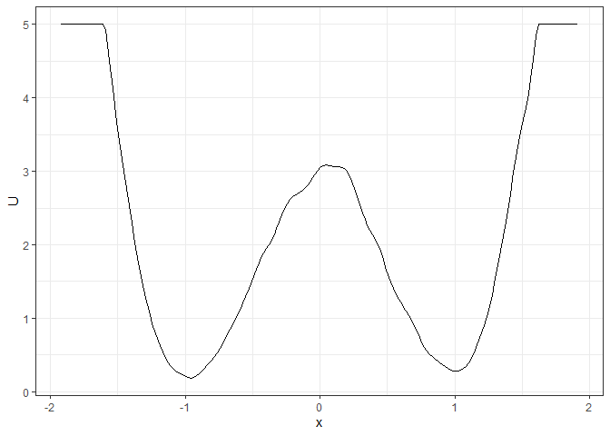
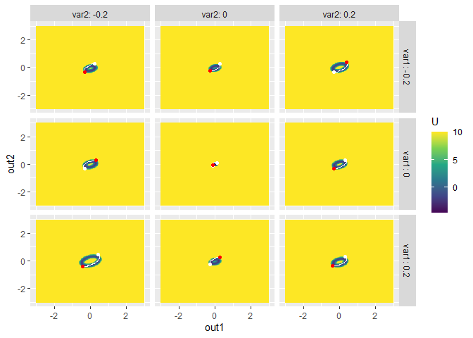
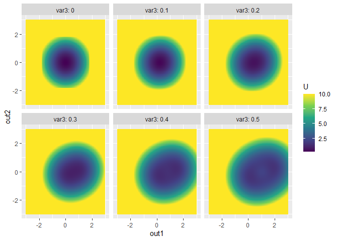
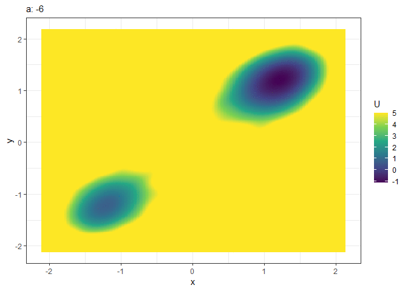
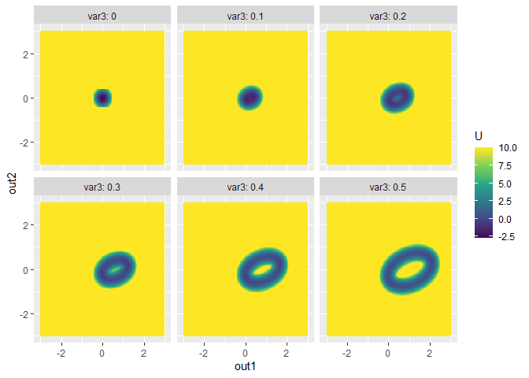
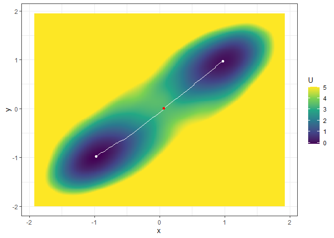
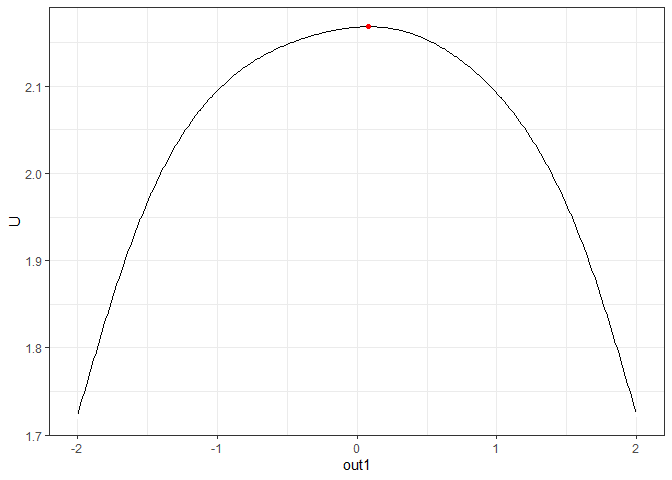
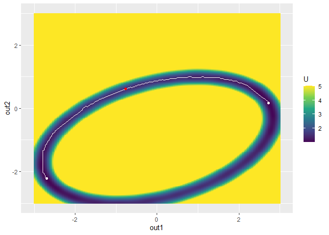

<!-- README.md is generated from README.Rmd. Please edit that file -->

# `simlandr`: Simulation-Based Landscape Construction for Dynamical Systems 

[](https://cran.r-project.org/package=simlandr)

[](https://github.com/Sciurus365/simlandr/actions)
[](https://cran.r-project.org/package=simlandr)

A toolbox for constructing potential landscapes for dynamical systems
using Monte Carlo simulation. The method is based on the potential
landscape definition by [Wang et
al. (2008)](https://www.doi.org/10.1073/pnas.0800579105) (also see [Zhou
& Li, 2016](https://www.doi.org/10.1063/1.4943096), for further
mathematical discussions) and can be used for a large variety of models.

`simlandr` can help to:

1.  Run batch simulations for different parameter values;
2.  Store large simulation outputs into hard drive by the reusable
    `hash_big_matrix` class, and perform out-of-memory calculation;
3.  Check convergence of the simulations;
4.  Construct 2d, 3d, 4d potential landscapes based on the simulation
    outputs;
5.  Calculate the minimal energy path and barrier height for transitions
    between states.

## Installation

You can install the released version of `simlandr` from
[CRAN](https://cran.r-project.org/) with:

``` r
install.packages("simlandr")
```

And you can install the development version from
[GitHub](https://github.com/) with:

``` r
install.packages("devtools")
devtools::install_github("Sciurus365/simlandr")
devtools::install_github("Sciurus365/simlandr", build_vignettes = TRUE) # Use this command if you want to build vignettes
```

## Example

``` r
library(simlandr)

# Simulation

## Single simulation

single_output_grad <- sim_fun_grad(length = 1e4, seed = 1614)

## Batch simulation: simulate a set of models with different parameter values
batch_arg_set_grad <- new_arg_set()
batch_arg_set_grad <- batch_arg_set_grad %>%
  add_arg_ele(
    arg_name = "parameter", ele_name = "a",
    start = -6, end = -1, by = 1
  )
batch_grid_grad <- make_arg_grid(batch_arg_set_grad)
batch_output_grad <- batch_simulation(batch_grid_grad, sim_fun_grad,
  default_list = list(
    initial = list(x = 0, y = 0),
    parameter = list(a = -4, b = 0, c = 0, sigmasq = 1)
  ),
  length = 1e4,
  seed = 1614,
  bigmemory = FALSE
)

batch_output_grad
#> Output(s) from 6 simulations.

# Construct landscapes

## Example 1. 2D (x, y as U) landscape
l_single_grad_2d <- make_2d_static(single_output_grad, x = "x")
plot(l_single_grad_2d)
```



``` r

### To make the landscape smoother
make_2d_static(single_output_grad, x = "x", adjust = 5) %>% plot()
```


``` r

## Example 2. 3D (x, y, color as U) landscape
l_single_grad_3d <- make_3d_static(single_output_grad, x = "x", y = "y", adjust = 5)
plot(l_single_grad_3d, 2)
```



``` r

### plot(l_single_grad_3d) # to show the landscape in 3D (x, y, z)

## Example 3. 4D (x, y, z, color as U) landscape
set.seed(1614)
single_output_grad <- matrix(runif(nrow(single_output_grad), min = 0, max = 5), ncol = 1, dimnames = list(NULL, "z")) %>% cbind(single_output_grad)
l_single_grad_4d <- make_4d_static(single_output_grad, x = "x", y = "y", z = "z", n = 50)
### plot(l_single_grad_4d) # to show the landscape in 4D (x, y, z, color as U)

## Example 4. 2D (x, y as U) matrix (by a)
l_batch_grad_2d <- make_2d_matrix(batch_output_grad, x = "x", cols = "a", Umax = 8, adjust = 2)
plot(l_batch_grad_2d)
```



``` r

## Example 5. 3D (x, y, color as U) matrix (by a)
l_batch_grad_3d <- make_3d_matrix(batch_output_grad, x = "x", y = "y", cols = "a")
plot(l_batch_grad_3d)
```


``` r

## Example 6. 3D (x, y, color as U) animation (by a)
l_batch_grad_3d_animation <- make_3d_animation(batch_output_grad, x = "x", y = "y", fr = "a")
plot(l_batch_grad_3d_animation, 2)
```



``` r
### plot(l_single_grad_4d) # to show the landscape in 3D (x, y, z as U)

# Calculate energy barriers
## Example 1. Energy barrier for the 2D landscape
b_single_grad_2d <- calculate_barrier(l_single_grad_2d,
  start_location_value = -1, end_location_value = 1,
  start_r = 0.3, end_r = 0.3
)
summary(b_single_grad_2d)
#> delta_U_start   delta_U_end 
#>      2.896270      2.806378

plot(l_single_grad_2d) + get_geom(b_single_grad_2d)
```



``` r

## Example 2. Energy barrier for the 3D landscape
b_single_grad_3d <- calculate_barrier(l_single_grad_3d,
  start_location_value = c(-1, -1), end_location_value = c(1, 1),
  start_r = 0.3, end_r = 0.3
)
summary(b_single_grad_3d)
#> delta_U_start   delta_U_end 
#>      3.491516      3.360399
plot(l_single_grad_3d, 2) + get_geom(b_single_grad_3d)
```



``` r

## Example 3. Energy barrier for many 2D landscapes
b_batch_grad_2d <- calculate_barrier(l_batch_grad_2d,
  start_location_value = -1, end_location_value = 1,
  start_r = 0.3, end_r = 0.3
)
summary(b_batch_grad_2d)
#> # A tibble: 6 × 9
#>   start_x start_U end_x  end_U saddle_x saddle_U  cols delta_U_start delta_U_end
#>     <dbl>   <dbl> <dbl>  <dbl>    <dbl>    <dbl> <dbl>         <dbl>       <dbl>
#> 1  -1.21    1.56  1.21  -0.332  -0.171     7.10     -6         5.54       7.43  
#> 2  -1.08    0.243 1.08   0.348   0.0418    4.65     -5         4.40       4.30  
#> 3  -0.957   0.355 0.977  0.454   0.0418    2.87     -4         2.52       2.42  
#> 4  -0.808   0.530 0.807  0.572   0.0205    1.62     -3         1.09       1.05  
#> 5  -0.702   0.710 0.700  0.659   0.0205    0.884    -2         0.174      0.225 
#> 6  -0.702   0.895 0.700  0.834  -0.702     0.895    -1         0          0.0613
plot(l_batch_grad_2d) + get_geom(b_batch_grad_2d)
```



``` r

## Example 4. Energy barrier for many 3D landscapes
b_batch_grad_3d <- calculate_barrier(l_batch_grad_3d,
  start_location_value = c(-1, -1), end_location_value = c(1, 1),
  start_r = 0.3, end_r = 0.3
)
summary(b_batch_grad_3d)
#> # A tibble: 6 × 12
#>   start_x start_y start_U end_x end_y  end_U  saddle_x  saddle_y saddle_U  cols
#>     <dbl>   <dbl>   <dbl> <dbl> <dbl>  <dbl>     <dbl>     <dbl>    <dbl> <dbl>
#> 1  -1.21   -1.21   0.735  1.21  1.21  -1.14  -0.213    -0.259        9.40    -6
#> 2  -1.08   -1.10  -0.480  1.10  1.12  -0.369  0.0843    0.151        5.40    -5
#> 3  -0.978  -0.992 -0.257  0.977 0.993 -0.133  0.0843    0.000337     3.60    -4
#> 4  -0.851  -0.820  0.0797 0.849 0.820  0.148  0.0843    0.108        1.99    -3
#> 5  -0.702  -0.712  0.608  0.700 0.712  0.466 -0.000710  0.0866       1.33    -2
#> 6  -0.702  -0.712  1.12   0.700 0.712  1.11  -0.702    -0.712        1.12    -1
#> # … with 2 more variables: delta_U_start <dbl>, delta_U_end <dbl>
plot(l_batch_grad_3d) + get_geom(b_batch_grad_3d)
```



# Vignettes

See the vignettes of this package (`browseVignettes("simlandr")` or
<https://psyarxiv.com/pzva3/>) for more examples and explanations.

<!-- devtools::build_readme() -->
