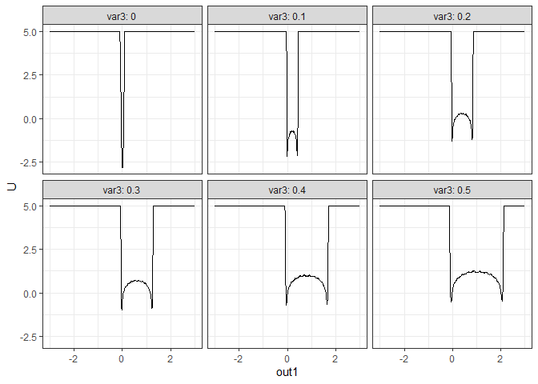

<!-- README.md is generated from README.Rmd. Please edit that file -->

# simlandr


[](https://github.com/Sciurus365/simlandr/actions)

The goal of simlandr is to provide a set of tools for constructing
potential landscape function for dynamic systems, especially for
psychological formal models.

## Installation

You can install the development version from
[GitHub](https://github.com/) with:

``` r
# install.packages("devtools")
devtools::install_github("Sciurus365/simlandr")
```

## Example

``` r
library(simlandr)

# Single simulation

single_test <- sim_fun_test(par1 = list(var1 = 1), 
                                                        par2 = list(var2 = 1, var3 = 0))

# Batch simulation: simulate a set of models with different parameter values

## Step 1: create a variable set
batch_test <- new_var_set()

## Step 2: add variable and its range to the set
batch_test <- batch_test %>%
    add_var("par2", "var3", 0, 0.5, 0.1)

## Step 3: make variable grids
batch_test_grid <- make_var_grid(batch_test)

## Step 4: run the batch simulation
batch_test_result <- batch_simulation(batch_test_grid, sim_fun_test,
  default_list = list(
    par1 = list(var1 = 0),
    par2 = list(var2 = 0, var3 = 0)
  )
)

batch_test_result
#> Output(s) from 6 simulations.
batch_test_result <- attach_all_matrices(batch_test_result)

# WARNING if you are using bigmemory: Due to a bug of RStudio(https://github.com/rstudio/rstudio/issues/8923), its variable inspector cannot handle objects with null external pointers. Work around: Turn off "automatically load workspace image"; change the variable inspector to "Manual refresh only", and then load the image and use attach_all_matrices for all batch simulations. After that, you can safely use the variable inspector. #

# Batch simulation with two parameters

batch_test2 <- new_var_set()
batch_test2 <- batch_test2 %>%
  add_var("par1", "var1", -0.2, 0.2, 0.2) %>%
  add_var("par2", "var2", -0.2, 0.2, 0.2)
batch_test_grid2 <- make_var_grid(batch_test2)

batch_test_result2 <- batch_simulation(batch_test_grid2, sim_fun_test, bigmemory = FALSE,
  default_list = list(
    par1 = list(var1 = 0),
    par2 = list(var2 = 0, var3 = 0)
  )
)
batch_test_result2
#> Output(s) from 9 simulations.

# Build landscapes

## 1. 2d density landscape
l1 <- make_2d_density(single_test, x = "out1", from = -2, to = 2, adjust = 1)
plot(l1)
```


``` r
## 2. 3d static interactive landscape

l2 <- make_3d_static(single_test, x = "out1", y = "out2", lims = c(-3,3,-3,3), h = 0.01, kde_fun = "ks")
#> Calculating the smooth distribution...
#> Done!
#> Making the plot...
#> Done!
#> Making the 2d plot...
#> Done!

# l2 <- make_3d_static(single_test, x = "out1", y = "out2", lims = c(-3,3,-3,3), h = 0.5, kde_fun = "MASS") # If you want to use kernel smooth function from MASS
# plot(l2) # Markdown cannot render interactive plots. You can try to run this command at your device.
plotly::orca(plot(l2), file = "man/figures/README-example-l2.png")
```

``` r
knitr::include_graphics("man/figures/README-example-l2.png")
```


``` r
plot(l2, 2) # the heatmap version
```


``` r
## 3. 3d landscape animation with a changing parameter
l3 <- make_3d_animation_multisim(batch_test_result, x = "out1", y = "out2", fr = "var3", zmax = 10, lims = c(-3,3,-3,3), h = 0.2)
#> Wrangling data...
#> Done!
#> Making the plot...
#> Done!
#> Making the 2d plot...
#> Done!
#> Making the 3d matrix...
#> Making the 2d plot...
#> Done!
#> Done!
# plot(l3)
plotly::orca(plot(l3), file = "man/figures/README-example-l3.png")
```

``` r
knitr::include_graphics("man/figures/README-example-l3.png")
```


``` r
plot(l3, 3)
```


``` r
## 4. 2d density matrix with two changing parameters
l4 <- make_2d_matrix(batch_test_result2, x = "out1", rows = "var1", cols = "var2", from = -3, to = 3)
#> Making the plot...
#> Done!
plot(l4)
```


``` r
l4_1 <- make_2d_matrix(batch_test_result, x = "out1", cols = "var3", from = -3, to = 3)
#> Making the plot...
#> Done!
plot(l4_1)
```



``` r
## 5. 3d (including color dimension) heatplot matrix with two changing parameters
l5 <- make_3d_matrix(batch_test_result2, x = "out1", y = "out2", rows = "var1", cols = "var2", lims = c(-3,3,-3,3), h = 0.01, kde_fun = "ks", zmax = 10)
#> Making the 2d plot...
#> Done!
plot(l5)
```


``` r
l5_1 <- make_3d_matrix(batch_test_result, x = "out1", y = "out2", cols = "var3", lims = c(-3,3,-3,3), h = 0.01, kde_fun = "ks", zmax = 10)
#> Making the 2d plot...
#> Done!
plot(l5_1)
```


<!-- devtools::build_readme() -->
