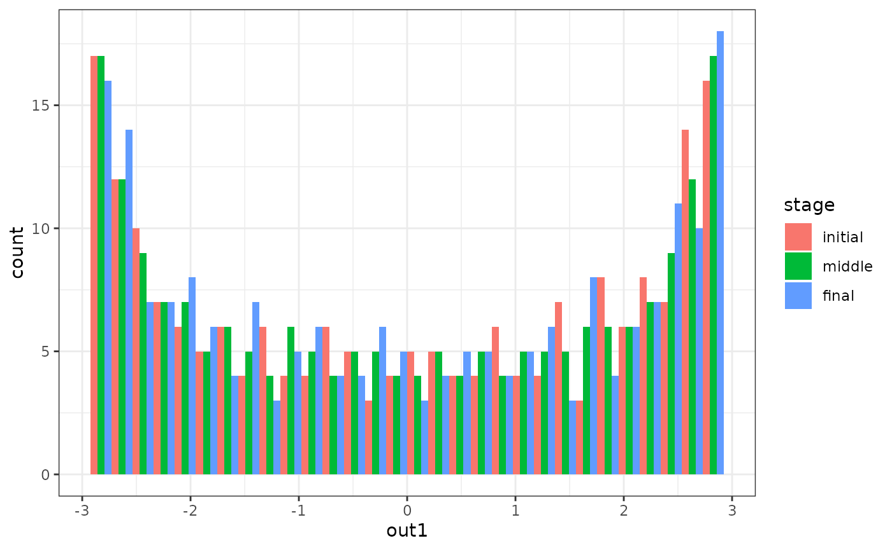
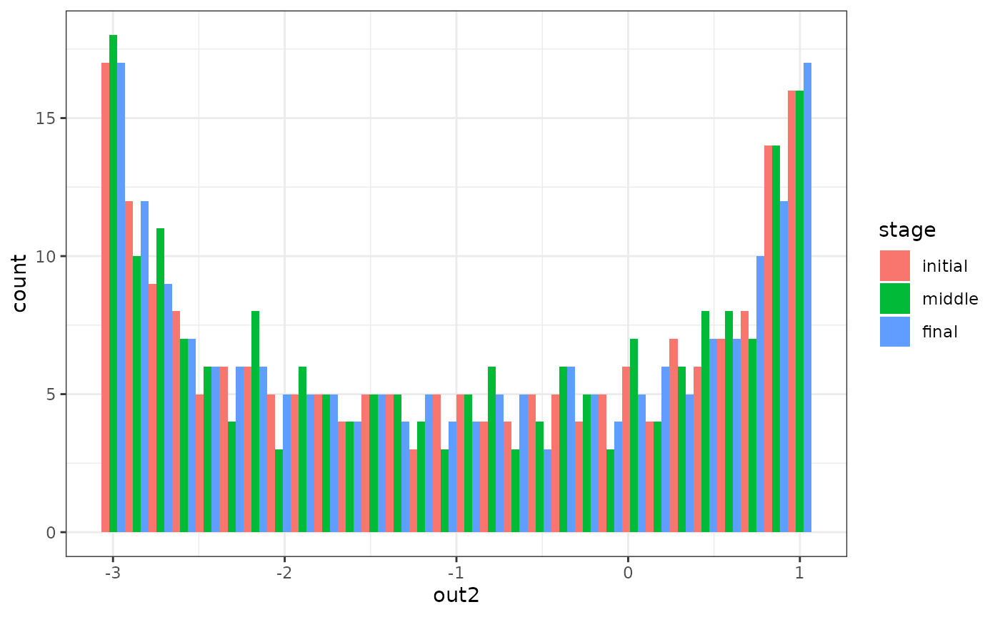
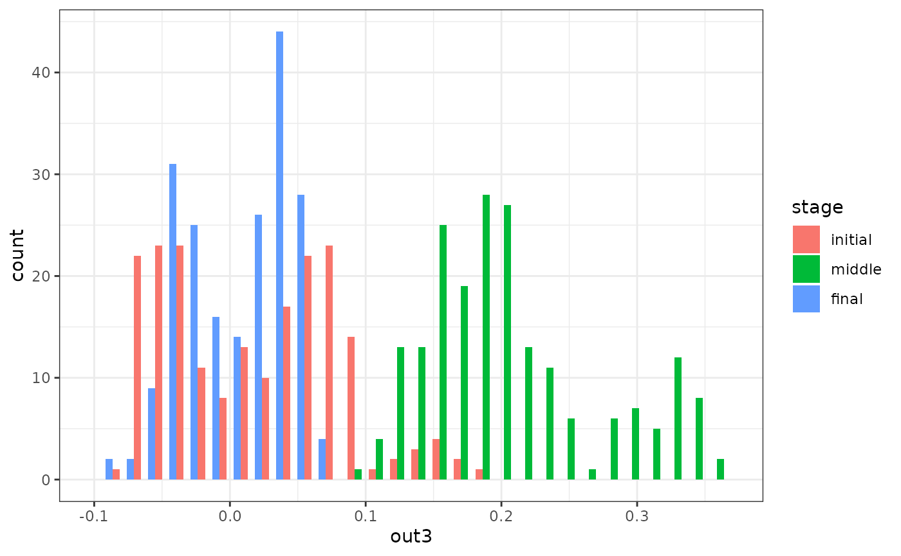

# 1. Dynamic models and simulations

``` r

library(simlandr)
```

## Introduction

The whole story starts with a dynamic model.

Formally speaking, a **dynamic model** is a set of equations that
specify how all the variables of a system change over time. It usually
takes the form of (stochastic) differential/difference equations.

These dynamic models are rather abstract, so they can only be used for
computation when they are implemented in a simulation function. A
**simulation function** is a function that simulates how the model
variables change over time. It takes some parameters as input and
returns a recording of the simulation process.

Currently, the whole package can only support the simulation function in
a certain format. It should take (besides from other parameters) lists
of model parameters as input, and give a matrix as the output. If your
original simulation function is in another format, maybe some
modification is needed.

If the dynamic system takes a simpler form, you may also use the
functions
[`sim_SDE()`](https://sciurus365.github.io/simlandr/reference/sim_SDE.md).
And you can use
[`multi_init_simulation()`](https://sciurus365.github.io/simlandr/reference/multi_init_simulation.md)
to simulate the system from different initial points. We are still
working on a concrete example with those functions. For now, please
consult the documentation of the functions.

`simlandr` package provides a simulation function for a simple toy
model, which is called
[`sim_fun_test()`](https://sciurus365.github.io/simlandr/reference/sim_fun_test.md).
You can use this as an example of the correct function format. I will
also use this function as an example throughout this vignette. It takes
`arg1` and `arg2` as parameters: `arg1` should be a list containing
`ele1` and `ele2`, and `arg2` should be a list containing `ele3`. It
takes this nested structure because real-life functions often have a
bunch of parameters in different categories (e.g., starting values,
model parameters, parameters that control the behavior of the simulation
function, etc.) To avoid confusion in terms, the package refers to these
first-layer parameters as *arg*s and second-layer parameters as *ele*s.

``` r

sim_fun_test
#> function (arg1, arg2, length = 1000) 
#> {
#>     output <- matrix(nrow = length, ncol = 3)
#>     colnames(output) <- c("out1", "out2", "out3")
#>     output[1, ] <- c(arg1$ele1, arg2$ele2, rnorm(1, sd = 0.01))
#>     for (i in 2:length) {
#>         output[i, 1] <- 0.5 * output[i - 1, 1] + output[i - 1, 
#>             2] + arg2$ele3 + arg1$ele1 * arg2$ele2
#>         output[i, 2] <- -0.5 * output[i - 1, 1] + output[i - 
#>             1, 2] + arg2$ele3
#>         output[i, 3] <- output[i - 1, 3] + rnorm(1, sd = 0.01)
#>     }
#>     return(output)
#> }
#> <bytecode: 0x55ba587d0b30>
#> <environment: namespace:simlandr>
```

## Single simulation

For the author of a simulation function, running a single simulation is
easy. You can just run the function normally, and assign the output to a
variable. (If you are using others’ simulation functions, please read
its documentation or ask the author about how to run it correctly.)

``` r

single_test <- sim_fun_test(
  arg1 = list(ele1 = 1),
  arg2 = list(ele2 = 1, ele3 = 0)
)
head(single_test)
#>          out1     out2        out3
#> [1,]  1.00000  1.00000 -0.01400044
#> [2,]  2.50000  0.50000 -0.01144726
#> [3,]  2.75000 -0.75000 -0.03581990
#> [4,]  1.62500 -2.12500 -0.03587561
#> [5,] -0.31250 -2.93750 -0.02966009
#> [6,] -2.09375 -2.78125 -0.01817597
```

For Monte-Carlo methods, it is important that the simulation
**converges**. In our case, it means the distribution of the system is
roughly stable. Only when the distribution estimation is good enough can
we construct reasonable landscapes based on that. `simlandr` provides a
function
[`check_conv()`](https://sciurus365.github.io/simlandr/reference/check_conv.md)
to check if the simulation converges. It takes the initial, middle, and
final parts of the simulation result and calculates distributions based
on that. If these distributions look similar, we can say the simulation
already converges. *A rare exception is that the simulation is so short
or the noise of the system is so low that during the whole simulation
the system is in one local stable state. A rough knowledge of the system
would be enough to rule out this situation.*

``` r

check_conv(single_test, c("out1", "out2", "out3"))
#> `stat_bin()` using `bins = 30`. Pick better value `binwidth`.
```



    #> Press <Enter> to see the next plot...
    #> `stat_bin()` using `bins = 30`. Pick better value `binwidth`.



    #> Press <Enter> to see the next plot...
    #> `stat_bin()` using `bins = 30`. Pick better value `binwidth`.



    #> Press <Enter> to see the next plot...

From the plots, we can see that variables `out1` and `out2` have
converged, but `out3` has not. However, as you might already realize,
`out3` is basically a 1d random walk process. Its distribution never
converges (so it can provide a good example of non-convergence).
Therefore, we will not extend the simulation length.

## Out-of-memory storage of the simulation output

Sometimes the output of the simulation is so large that it cannot be
handled properly in the following computation. (Rule of thumb: retain
matrices of \> 1 GB in memory is likely to produce future problems in a
computer with 8 GB memory.) In this case, you can use the `bigmemory`
package to put it into your hard drive. `bigmemory` only preserves a
pointer in the memory, so it can save the memory space significantly. In
most cases, you can treat it as a normal matrix. As far as I have
tested, `simlandr` is fully compatible with `bigmemory`.

``` r

# NOT RUN
single_test <- bigmemory::as.big.matrix(single_test, backingfile = "single_test.bin", descriptorfile = "single_test.desc")
```

The pointer only exists in a single session. In other words, if you
close the session and reload the workspace image, the pointers will
become `NULL`, and `bigmemory` attachment does not restore by itself. In
order to use it again, use the following command to attach the file.

*To avoid compatibility problems, this vignette does not run
out-of-memory related codes.*

``` r

# NOT RUN
single_test <- bigmemory::attach.big.matrix("single_test")
```

------------------------------------------------------------------------

**⚠ WARNING**

Due to a bug of RStudio
(<https://github.com/rstudio/rstudio/issues/8923>), its variable
inspector cannot handle objects with null external pointers. Sometimes
it results in a fatal error when loading workspace images with previous
`bigmemory`-related objects.

Current work-around before the bug is fixed:

1.  Turn off “Restore .RData into workspace at startup” at Tools -\>
    Project Options -\> General
2.  Switch the variable inspector to “Manual Refresh Only”
3.  Load the workspace image
4.  Attach all `bigmemory`-related objects using
    [`bigmemory::attach.big.matrix()`](https://rdrr.io/pkg/bigmemory/man/attach.big.matrix.html),
    [`simlandr::attach_hash_big_matrix()`](https://sciurus365.github.io/simlandr/reference/hash_big_matrix-class.md)
    or
    [`simlandr::attach_all_matrices()`](https://sciurus365.github.io/simlandr/reference/attach_all_matrices.md)
    (introduced later).

After that, you can safely use/refresh the variable inspector.

------------------------------------------------------------------------

To reuse these images on a hard drive, `big.matrix` class in `bigmemory`
requires an explicit file name for each matrix. This can be cumbersome
if you need to handle a lot of matrices. (And this is even a bigger
problem for batch simulation; see next section.) Therefore, `simlandr`
provides a `hash-big.matrix` class to solve this problem. The
`hash-big.matrix` class is a modification of `big.matrix` class in
`big.memory` package, but it automatically generates the file names
using the md5 values of the matrices. (For those who are not familiar
with md5: it is a hash algorithm that can guarantee to give different
names to different matrices in a reasonable simulation context.) The md5
value is also stored in the `md5` slot of `hash-big.matrix` objects.
Therefore, the file link can also be restored automatically without
having to specify a file name. By default, all the backing files of
`hash-big.matrix` objects are in `\bp` directory.

``` r

# NOT RUN
single_test <- as_hash_big.matrix(single_test)
single_test <- attach_hash_big.matrix(single_test)
```

## Batch simulation

Sometimes you need to simulate a set of models with different parameter
values. `simlandr` provides several tools to do this easily.

First, you need to make a `arg_grid` to specify the conditions of these
simulations in terms of `arg` values. The following is an example.

``` r

## Step 1: create a variable set
batch_test <- new_arg_set()

## Step 2: add variable and its starting, end, and increment values of the sequence (passed to `seq()`) to the set.
batch_test <- batch_test %>%
  add_arg_ele("arg2", "ele3", 0, 0.5, 0.1)

## Step 3: make variable grids
batch_test_grid <- make_arg_grid(batch_test)
```

Then you can run the batch simulation. `simlandr` use out-of-memory
storage for batch simulations by default because most times batch
simulation will result in very large data objects. In this case, each
simulation result is stored in a separate file. Thanks to the
`hash-big.matrix` class, you do not have to name each file by yourself.

`simlandr` also provides a
[`attach_all_matrices()`](https://sciurus365.github.io/simlandr/reference/attach_all_matrices.md)
function to help you attach all the out-of-memory `hash-big.matrix`s
related to a batch simulation. Use this if you want to load the previous
workspace image with (out-of-memory) batch simulation results. Keep in
mind that the **WARNING** above also holds for this.

``` r

# NOT RUN
batch_test_result <- batch_simulation(batch_test_grid, sim_fun_test,
  default_list = list(
    arg1 = list(ele1 = 0),
    arg2 = list(ele2 = 0, ele3 = 0)
  ),
  bigmemory = TRUE
)

batch_test_result <- attach_all_matrices(batch_test_result)
```

If you want to keep all the original data in the memory, you can use
`bigmemory = FALSE` to disable this.

``` r

batch_test_result <- batch_simulation(batch_test_grid, sim_fun_test,
  default_list = list(
    arg1 = list(ele1 = 0),
    arg2 = list(ele2 = 0, ele3 = 0)
  ),
  bigmemory = FALSE
)
```

The output of
[`batch_simulation()`](https://sciurus365.github.io/simlandr/reference/batch_simulation.md)
function is a `batch_simulation` object, which is, basically, a complex
`data.frame` with simulation outputs and corresponding parameter values.
You can manipulate it as a `data.frame` for your purpose.

``` r

print(batch_test_result)
#> Output(s) from 6 simulations.
print(tibble::as_tibble(batch_test_result))
#> # A tibble: 6 × 3
#>   ele_list        ele3 output           
#>   <list>         <dbl> <list>           
#> 1 <ele_list [1]>   0   <dbl [1,000 × 3]>
#> 2 <ele_list [1]>   0.1 <dbl [1,000 × 3]>
#> 3 <ele_list [1]>   0.2 <dbl [1,000 × 3]>
#> 4 <ele_list [1]>   0.3 <dbl [1,000 × 3]>
#> 5 <ele_list [1]>   0.4 <dbl [1,000 × 3]>
#> 6 <ele_list [1]>   0.5 <dbl [1,000 × 3]>
```

`batch_simulation` objects are also the base for constructing landscapes
from multiple simulations. See other vignettes for details.
